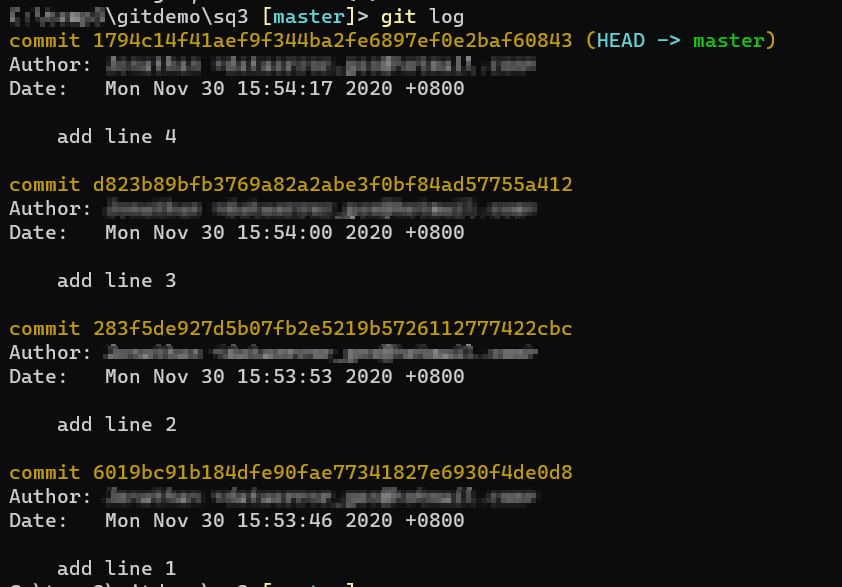
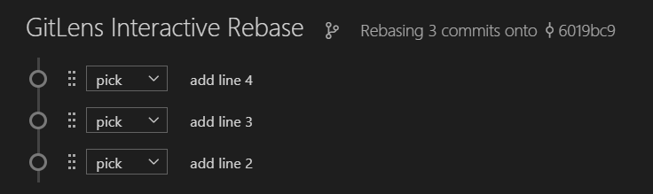
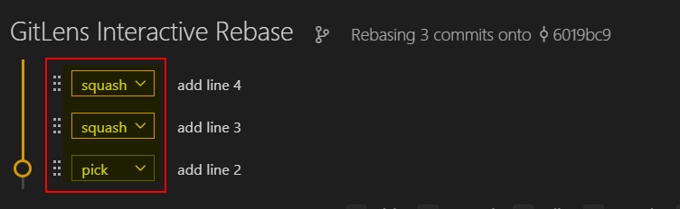
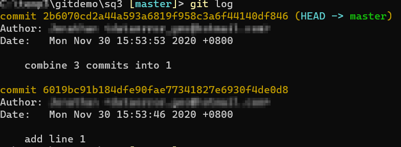

- [Squash](#squash)
  - [Squash multiple commits into one during merge](#squash-multiple-commits-into-one-during-merge)
  - [Squash multiple commits into one within the same branch](#squash-multiple-commits-into-one-within-the-same-branch)
- [Git tag](#git-tag)
  - [Create tag from server side.](#create-tag-from-server-side)
  - [Create tag from local and push to server.](#create-tag-from-local-and-push-to-server)
- [Bisect](#bisect)
  - [Using Bisect to find bad commit](#using-bisect-to-find-bad-commit)


# Squash
## Squash multiple commits into one during merge
1. Run **git init** to initialize a git repo.
2. Create a new file *file1.txt*.
3. Add a new line "line 1" and commit it with message "add line 1"
4. Create a new branch call *f1*, run **git checkout -b f1**
5. Add 3 lines and commit each line separately.
```Powershell
Add-Content -Path .\file1.txt -Value 'line 2'
git add file1.txt
git commit -m "add line 2"

Add-Content -Path .\file1.txt -Value 'line 3'
git add file1.txt
git commit -m "add line 3"

Add-Content -Path .\file1.txt -Value 'line 4'
git add file1.txt
git commit -m "add line 4"
```
6. Run **git log** and you should see 4 commits.
7. Swith back to *master* branch, run **git checkout master**.
8. Now we want to merge *f1* branch into *master*. Run **git log master..f1** and you should see that there are 3 commits to be merge.
9. In this case, we don't really care about the interim history in the *f1* branch. What we want is when we merge, the 3 commits will be squash into one single commit. 
10. Run **git merge --squash f1** to take the 3 commits and merge as one commit.
11. Run **git commit -m "merge from f1"** to commit the merge.
12. Run **git log** to verify that there is only one commit.


## Squash multiple commits into one within the same branch
1. Run **git init** to initialize a git repo.
2. Create a new file *file1.txt*.
3. Add 4 lines and commit each line separately.
```Powershell
Add-Content -Path .\file1.txt -Value 'line 1'
git add file1.txt
git commit -m "add line 1"

Add-Content -Path .\file1.txt -Value 'line 2'
git add file1.txt
git commit -m "add line 2"

Add-Content -Path .\file1.txt -Value 'line 3'
git add file1.txt
git commit -m "add line 3"

Add-Content -Path .\file1.txt -Value 'line 4'
git add file1.txt
git commit -m "add line 4"
```
4. Run **git log** and you should see 4 commits.
   
   
5. Now we want to combine the last 3 commit ('add line 2' to 'add line 4') into a single commit.
6.  Run **git rebase -i HEAD~3**. This tell git we want to interactively rebase the last 3 commit from the HEAD. This will open in editor.
   * If you have Visual Studio Code, this may open a rebase/squash editor in VS Code.
   
7. Keep the line for 'add line 2' as it is. Change the 'pick' to 'squash' for 'add line 3' and 'add line 4'.
    
8. Save and close the editor.
9. Another editor will prompt up for you to enter a commit message. Enter a commit message, save and close the editor.
10. Run **git log** and you should only see 2 commits now.
    


# Git tag
## Create tag from server side.
1. Create a server side repo, name it *tagdemo*.
2. In the local folder, clone from *tagdemo*.
3. Run following Powershell scripts to create a file and do a few commits.
```Powershell
Add-Content -Path .\file1.txt -Value 'line1'
git add file1.txt
git commit -m "add line 1"

Add-Content -Path .\file1.txt -Value 'line2'
git add file1.txt
git commit -m "add line 2"

Add-Content -Path .\file1.txt -Value 'line3'
git add file1.txt
git commit -m "add line 3"

Add-Content -Path .\file1.txt -Value 'line4'
git add file1.txt
git commit -m "add line 4"

Add-Content -Path .\file1.txt -Value 'line5'
git add file1.txt
git commit -m "add line 5"
```
4. Run **git push** to push it to server.
5. On the server side, Under **Repos | Files**, click on *file1.txt*, and go to the **History** tab.
6. To the right of "add line 3" commit, click on the triple dot and select **Create Tag**.
7. Give the tag name '*release1*' and enter a description, click **Create**.
8. If you go to **Repos | Tags**, you can see the tag listed there.
9.  Go to the local folder, and **run git tag -l** and you see no tag yet.
10. Run **git pull** to update the local repo.
11. run **git tag -l** again and you see the tag.
12. We can check the contents of the tag by running **git checkout release1**.
13. Run **git log** and show the content of *file1.txt*.
14. You can also create a new branch from this tag. This is useful for scenario which you wwant to make a code change or bug fix baed on specific commit or "release". Run **git switch -c r1patch1**.
15. Open *file1.txt* and change "line2" to "line2a".
16. Commit the change.
17. Push the commit to server. Since this branchh does not exist on server yet, we need to run **git push -u origin r1patch1:r1patch1**.
18. Go to the server repo and chech that you have the new branch with the expected commit. You can now proceed to do Pull Request to merge in a normal workflow, but we will not do that for this demo.
  
## Create tag from local and push to server.
Complete the demo [Create tag from local and push to server.](#create-tag-from-local-and-push-to-server) to setup the backdrop. If not at least perform step 1 to 4.
1. In the local repo, run **git log** to find the commit hash for "add line 4" .
2. We will create a tag based on the commit for "add line 4". Run **git tag -a alpha1 \<hash for add line 4\> -m "This is alpha test"**.
3. Run **git tag -l** to make sure the tag is created.
4. Run **git push origin alpha1** to push the tag to server. (syntax: **git push \<repo_name\> \<tagname\>**)
5. Go to server repo and you should see the tag you just pushed.
6. Side note: You can also push all tags by **git push --tags \<repo-name\>**. But this is uncommon because it is unlikely you will create a bunch of random tags and push it to server.

# Bisect
## Using Bisect to find bad commit
There is times when you commit a bad code without realizing it until ways later. You will have to backtrack each commit to find out which commit introduce the bad code. Git Bisect give you a much better way to do this. Bisect use a binary tree approach to divide and conquer and lead you to the bad commit much faster. It divide the commits log into two and ask you whether the current commit is good or bad, and then eliminate the right half of the tree and continue the process until you identify the bad commit.
1. Run the following Powershell script to setup the backdrop. It initialize a git repo and make ten commits to file1.txt. The third commit is where we introduce the bad code.
   ```powershell
    git init
    1..10 | ? {
      $n = $_
      
      if($n -eq 3)
      {
        Add-Content -Path .\file1.txt -Value "line $n - buggy"
      }
      else
      {
        Add-Content -Path .\file1.txt -Value "line $n"
      }
      git add file1.txt
      git commit -m "add line $n"
    }   
   ```
2. For simplicity, assuming that we know the first commit was a good one and the latest commit contain bad code. Our mission is to find out which commit introduce the bad code. Run ```git log --oneline``` to get the commit history. Take note the commit ID of "add line 1" (first commit) and "add line 10" (contain bad commit).
3. Run ```git bisect start``` to start the bisect interactive command. It will help you through the elimination process to find the source of the bad commit until you run ```git bisect reset```. After you run ```git bisect start```, it will return the control back to the command prompt.
4. We first specify the good commit. Run ```git bisect good <commit ID of add line 1>```.
5. Then we specify the bad commit. The bad commit is the one we know contain the bad code, but not necessary the one that introduce it. Run ```git bisect bad <commit ID of add line 10>```.
6. Git tell you how many more commits to check and roughly how many iteration it still need to complete this. Since there is ten commits between the good and bad, it tell us there are four more to check in two steps (remember it divide the list of commits to two). You should see that you are now on the fifth commit (add line 5). Git automatically checkout this commit for us. This commit is halfway between the good and latest bad commit.
7. Run ```cat file1.txt```. You should see that it contain five lines including the buggy code. These represent the first five commits in the log.
8. Since this commit also contain the bad code, we will tell bisect to take the current five commits and divide it into half again. Run ```git bisect bad```. You should see a similar message as in step-6. You should now be on commit "add line 3".
   ```text
   Note: If the current commit does not contain the bad code, you run "git bisect good". Git will take the other half of the commit logs.
   ```
9.  Run ```cat file1.txt```. You should see that it contain three lines including the buggy code. These represent the first three commits in the log.
10. It still contain the buggy code and we are still unsure whether the current commit is the source of the bug. 
11. Run ```git bisect bad``` again. Run ```cat file1.txt``` to view the content of file1.txt. This time it does not contain the buggy code.
12. Since we now know the current commit is a good one, run ```git bisect good``` to tell git this commit does not contain the buggy code. Once you do this, git tell you the commit that introduce the bad code (add line 3).
13. You can now do the neccessary code fixing or take the neccessary action.
14. When you are done, run ```git bisect reset``` to bring you back to the HEAD.

```text
Exercise: Run the following code to create a new repo. But this time the buggy code is much closer
 to the latest commit. Use Bisect to identify the commit that introduce the error ("add line 9").

  git init
  1..10 | ? {
    $n = $_
    
    if($n -eq 9)
    {
      Add-Content -Path .\file1.txt -Value "line $n - buggy"
    }
    else
    {
      Add-Content -Path .\file1.txt -Value "line $n"
    }
    git add file1.txt
    git commit -m "add line $n"
  }
```