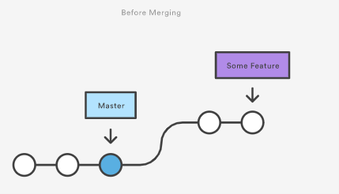
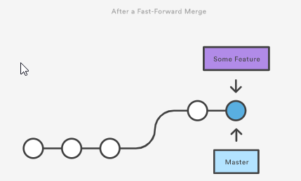
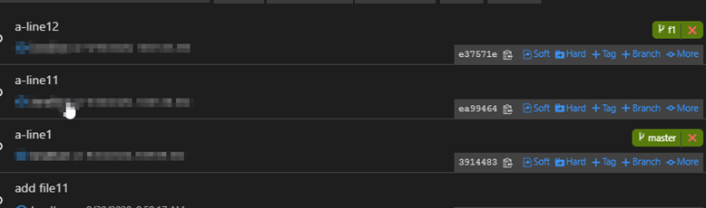
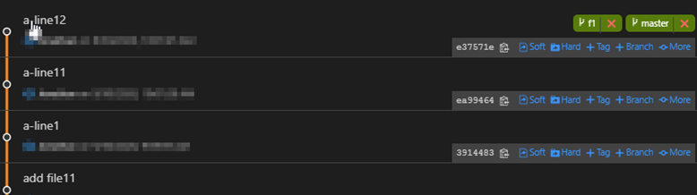
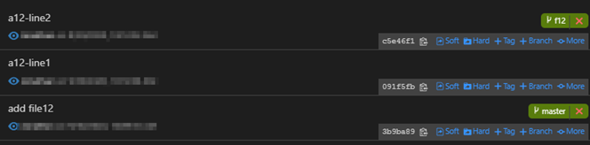
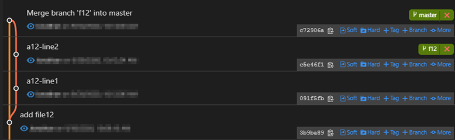
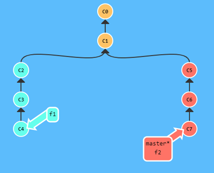
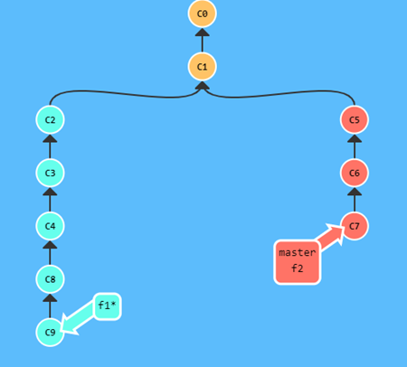
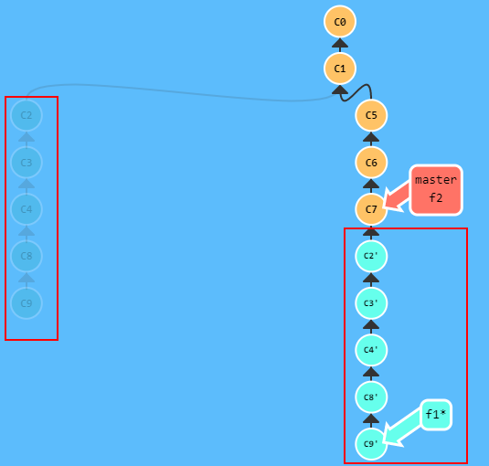

# Branching and merging.
This demo show how to use git branching and merging.

## Prerequisite
You need to create a server side repo in Azure DevOps first and clone it to local.

- [Branching and merging.](#branching-and-merging)
  - [Prerequisite](#prerequisite)
- [Branch](#branch)
  - [Create local branch and push to server](#create-local-branch-and-push-to-server)
  - [Delete branch that does not exist in server repo any more](#delete-branch-that-does-not-exist-in-server-repo-any-more)
  - [Create a branch from a commit](#create-a-branch-from-a-commit)
  - [Rename a branch](#rename-a-branch)
- [Merging](#merging)
  - [Fast forward merge](#fast-forward-merge)
  - [No fast forward merge](#no-fast-forward-merge)
  - [Checking how many commit to merge](#checking-how-many-commit-to-merge)
- [Commit](#commit)
  - [Show commits in a branch since it branch out from its parent.](#show-commits-in-a-branch-since-it-branch-out-from-its-parent)
  - [Show branch that contain a specific commit.](#show-branch-that-contain-a-specific-commit)
- [Diff](#diff)
  - [Compare a file between two branches](#compare-a-file-between-two-branches)
  - [show file changed in a branch.](#show-file-changed-in-a-branch)
- [Rebase](#rebase)
  - [Visualize git rebase](#visualize-git-rebase)
  - [Actual git rebase](#actual-git-rebase)


# Branch
## Create local branch and push to server
1. Run **git checkout -b f1** to create a local branch name *f1*.
2. Add a new file (f1a.txt)
3. Run **git add \*** and **git commit -m "\<some comment\>"** to commit change
4. Run **git push -u origin f1:f1** to push the new branch from local to server.
5. You can now verify the new branch in Azure Repo.

## Delete branch that does not exist in server repo any more
Prune server branch that does not exist
1. Switch branch to *master*. Run **git checkout master**.
2. Run **git branch -r** to show all remote branch
3. Run **git branch -vv** to show the remote tracking branch
4. Go to Azure DevOps repo and delete the *f1* branch
5. Run **git fetch**. 
6. Run **git branch -r** and **git branch -vv**. You still see the *f1* branch
7. Run **git fetch -p**
   * -p mean prune, to delete things that does not exist in server anymore.
8.	Run **git branch -r** and **git branch -vv**. You still see the *f1* branch no longer exist. 
9. However, this does not delete your local branch. You still need to delete the local branch yourself. If you run git push again from the local branch, the same branch will be re-created in the server repo.
   * Remember git is a distributed version control system, just because it does not exist in server, it doesn't assume it shouldn't exist on client.

## Create a branch from a commit
1. Run the following powershell script to setup a demo repo.
   ```powershell
   git init

   Add-Content -Path .\file1.txt -Value 'line1'
   git add file1.txt
   git commit -m "add line1"


   Add-Content -Path .\file1.txt -Value 'line2'
   git add file1.txt
   git commit -m "add line2"

   Add-Content -Path .\file1.txt -Value 'line3'
   git add file1.txt
   git commit -m "add line3"

   Add-Content -Path .\file1.txt -Value 'line4'
   git add file1.txt
   git commit -m "add line4"

   Add-Content -Path .\file1.txt -Value 'line5'
   git add file1.txt
   git commit -m "add line5"
   ```
2. Run **git log** to get the commit id of "add line3"
3. Run **git checkout -b f1 \<commit id\>**.
4. open file1.txt. You should see that file1 only has content as per commit "add line3".

## Rename a branch
1. Run the following script to setup a demo repo.
   ```bash
   git init

   echo "line1" >> file1.txt
   git add file1.txt
   git commit -m "add line1"
   ```
2. Create a new branch (f1) from master/main. Run `git checkout -b f1`.
3. To rename a branch to "feature1", run `git branch -m feature1`.
4. If this branch has a upstream branch, run `git push origin -u <new_branch_name>` to push the branch to origin with new name, then run `git push origin --delete <old_branch_name>` to delete the old branch from origin.

## Show remote tracking branch
1. Run the following command to show the remote tracking branch and their commit.
   ```git branch -vv```
   

# Merging
## Fast forward merge
A fast-forward merge can occur when there is a linear path from the current branch tip to the target branch. Instead of actually merging the branches, all Git has to do to integrate the histories is move (i.e., "fast forward") the current branch tip up to the target branch tip.




1. In master branch add and commit a new file (file11.txt)
2. Run **git checkout -b f1** to create a *f1* branch.
3. Add one line to file11.txt and commit. Do this two times.
4. Your history should look like this. F1 branch is 2 commit ahead of master
   
5. Run **git checkout master** to switch to master branch
6. Run **git merge f1**
7. Your history should look like this. Master and f1 is now the same. No new commit is created.
   
 

## No fast forward merge
No fast forward merge will create a new merge commit instead. This is useful if you require a record of house keeping for the history.
1. In *master* branch add and commit a new file (file12.txt)
2. Run **git checkout -b f2** to switch to *f2* branch.
3. Add one line to file12.txt and commit. Do this two times.
4. Your history should look like this. *f2* branch is 2 commit ahead of master.
   
5. Run **git checkout master** to switch to master branch
6. Run **git merge –-no-ff f2**
7. Your history should look like this. There is a new commit created after the merge and master HEAD is now pointing to the new commit.
   
 
## Checking how many commit to merge
1. Run **git init** to initialize a new git repo.
2. Create a new file named *file1.txt*
3. Add one line "line 1" to *file1.txt* and commit.
4. Create a new branch. Run **git checkout -b f1**.
5. Add "line 2" to file1.txt and commit. 
6. Add "line 3" to file1.txt and commit.
7. Add "line 4" to file1.txt and commit.
```powershell
Add-Content -Path .\file1.txt -Value 'line2'
git add file1.txt
git commit -m "add line 2"

Add-Content -Path .\file1.txt -Value 'line3'
git add file1.txt
git commit -m "add line 3"

Add-Content -Path .\file1.txt -Value 'line4'
git add file1.txt
git commit -m "add line 4"
```
8. Create a new file named file2.txt and commit.
```powershell
Add-Content -Path .\file2.txt -Value 'blah'
git add file2.txt
git commit -m "add file2"
```
9. Switch back to *master* branch to merge *f1* into *master*. Run **git checkout master**.
10. To see how many commits to be merge from f1 into master run **git log master..f1**. You should see there is 4 commits.
11. To see which files are part of the merge, run **git diff-tree HEAD f1**.
    * You can also replace the branch name with a commit hash if you want to compare against a specific commit.
12. You can also perform the similar using **git diff --name-only master f1**. This will show file name only.
    * You can also replace the branch name with a commit hash if you want to compare against a specific commit.


# Commit
## Show commits in a branch since it branch out from its parent.
1. Run **git init** to initialize a repo.
2. Run the following powershell script. This will create 7 commits in master with one new file added in each commit.
   ```powershell
    Add-Content -Path .\file1.txt -Value 'file1'
    git add file1.txt
    git commit -m "add file 1"

    Add-Content -Path .\file2.txt -Value 'file2'
    git add file2.txt
    git commit -m "add file 2"

    Add-Content -Path .\file3.txt -Value 'file3'
    git add file3.txt
    git commit -m "add file 3"

    Add-Content -Path .\file4.txt -Value 'file4'
    git add file4.txt
    git commit -m "add file 4"

    Add-Content -Path .\file5.txt -Value 'file5'
    git add file5.txt
    git commit -m "add file 5"

    Add-Content -Path .\file6.txt -Value 'file6'
    git add file6.txt
    git commit -m "add file 6"

    Add-Content -Path .\file7.txt -Value 'file7'
    git add file7.txt
    git commit -m "add file 7"
   ```
3. Run the powershell script to create a feature1 branch. This will create 3 commits in the feature1 branch, 2 of the commit will modify an existing file, and 1 commit will add a new file (file8.txt)
   ```powershell
    git checkout -b feature1

    Add-Content -Path .\file1.txt -Value 'file1-line2'
    git add file1.txt
    git commit -m "modify file 1"

    Add-Content -Path .\file2.txt -Value 'file2-line2'
    git add file2.txt
    git commit -m "modify file 2"

    Add-Content -Path .\file8.txt -Value 'file8'
    git add file8.txt
    git commit -m "add file 8"   
   ```   
4. Run **git log master..feature1**. This will show all commits done in feature1 only.
5. Similarly, if you want to know what are the new commits in your local repo compare to the remote, you can run **git log origin/master..master**.

## Show branch that contain a specific commit.
This demo is build on top of the previous one. Make sure you can complete the previous demonstration of *Show commits in a branch since it branch out from its parent*
1. Get the hash commit for 'add file 6'.
2. Run **git branch --contains \<hash of add_file_6\>**. You should see it list master and feature1.
3. Get the hash commit for 'modify file 2'.
4. Run **git branch --contains \<hash of modify_file_2\>**. You should see it list feature1 only.

# Diff
## Compare a file between two branches
This demo is build on top of the previous one. Make sure you can complete the previous demonstration of *Compare a file between two commits* in the basic_demo

1. From the *master* branch, create a new branch named f1. Run *git checkout -b f1*.
2.	Add two lines of text to file1.txt and commit.
3.	To compare a file between two branch, run *git diff master f1 –- file1.txt*.

Some reading on git diff:
* https://www.atlassian.com/git/tutorials/saving-changes/git-diff#:~:text=Comparing%20changes%20with%20git%20diff,%2C%20branches%2C%20files%20and%20more.
* https://www.git-tower.com/learn/git/ebook/en/command-line/advanced-topics/diffs/

## show file changed in a branch.
This demo is build on top of the previous one. Make sure you can complete the previous demonstration of *Show commits in a branch since it branch out from its parent*
1. Run **git diff --name-only master..feature1**. This will show you all the files that is changed in feature1 branch.
2. Run **git diff --name-status master..feature1**. This will show you status of all the files that is changed in feature1 branch.
# Rebase
This demo show how rebase happen. We will do this demo in two stages. First, by using a demo website to visualize the effects of rebase. Then we will do this with a real git repo.

## Visualize git rebase
1. Go to https://learngitbranching.js.org/. When ask to choose a learning path, press ESC until you see the console.
2. You should now in the master branch with commit *C1*.
3. Run **git checkout -b f1** to create a feature branch *f1*.
4. Run **git commit -m ""** three times to simulate 3 commit in *f1*.
5. We will switch back to *master* branch. Run **git checkout master**.
6.	Now we will simulate another developer working on the same code base by creating another feature branch. Run **git checkout -b f2** to create feature branch *f2*.
7.	Run **git commit -m ""** three times to simulate 3 commit in *f2*.
8.	Now let’s switch back to *master* branch and merge the change from *f2* into master.
9. Run **git checkout master** to switch back to *master* branch.
10. Run **git merge f2** to merge from *f2* into *master*.
11. Your git repo should look like this now.
    
    
12. Since we know the *master* branch has change since we branched out, we will rebase *f1* branch so that it is up-to-date with master.
13. Run **git checkout f1**.
14. Let’s add two more commit before we rebase. Run **git commit -m ""** two times. Your repo should look like below now.
    
15. Now, run **git rebase master**.
16. Notice how git take commit *C2*,*C3*,*C4*,*C8* and *C9* from *f1* and replay it on top of *C7* of *master* branch. Your head of *f1* branch is now pointing to the new commit. It should looks like following now.
    
    
 
 
## Actual git rebase
In this demo, we will perform git rebase on a real repo to see the effects. In this demo, a rebase conflict will arise and we will attempt to resolve it. While running this demo, you can open the folder of this git repo in VS code and use the Git Graph (https://marketplace.visualstudio.com/items?itemName=mhutchie.git-graph) extension to visualize your repo log.
1. Go to a empty folder and run **git init** to create a new repo.
2. Add a new file name *code1.txt*. Add "master line 1" into the file.
3. Add the file to the staging. Run **git add ***.
4. Commit the change. Run **git commit -m "initial checkin"**.
5. Run **git checkout -b f1** to create a feature branch *f1*.
6. Add a new line "dev1 line 1" to code1.txt.
7. Commit the change by run **git add** and **git commit**.
8. Add another commit to *code1.txt* by adding "dev1 line 2".
9. Add another commit to *code1.txt* by adding "dev1 line 3".
10. We will switch back to *master* branch. Run **git checkout master**.
11. Now we will simulate another developer working on the same code base by creating another feature branch. Run **git checkout -b f2** to create feature branch *f2*.
12. Add a new line "dev2 line 1" to *code1.txt*.
13. Commit the change by run **git add** and **git commit**.
14. Add another commit to *code1.txt* by adding "dev2 line 2".
15. Add another commit to *code1.txt* by adding "dev2 line 3".
16. Add a new file *code2.txt* with some content. Then commit this new file.
17. Now let's switch back to *master* branch and merge the change from *f2* into *master*.
18. Run **git checkout master** to switch back to *master* branch.
19. Run **git merge f2** to merge from *f2* into *master*.
20. Since we know the *master* branch has change since we branched out, we would like to rebase *f1* branch so that it is up-to-date with master.
21. Run **git checkout f1**.
22. Let's add two more commit before we rebase. 
23. Add one new commit to *code1.txt* by adding "dev1 line 4".
24. Add one new commit to *code1.txt* by adding "dev1 line 5".
25. Run **git log** to show the commit history for *f1* branch. And then later compare to what it is after we rebase.
26. Now, run **git rebase master**.
27. You now see that there is a conflict because both dev1 and dev2 edit the code1.txt in the same location.
28. What you have to do now is to resolve the conflict, then run **git add** and **git rebase –continue** until all conflict is resolved.
    * Most likely you need to do this to resolve conflict for "dev1 line1", "dev1 line2" and "dev1 line3".
29. Once you resolve all rebase conflict open *code1.txt* to show the final content.
