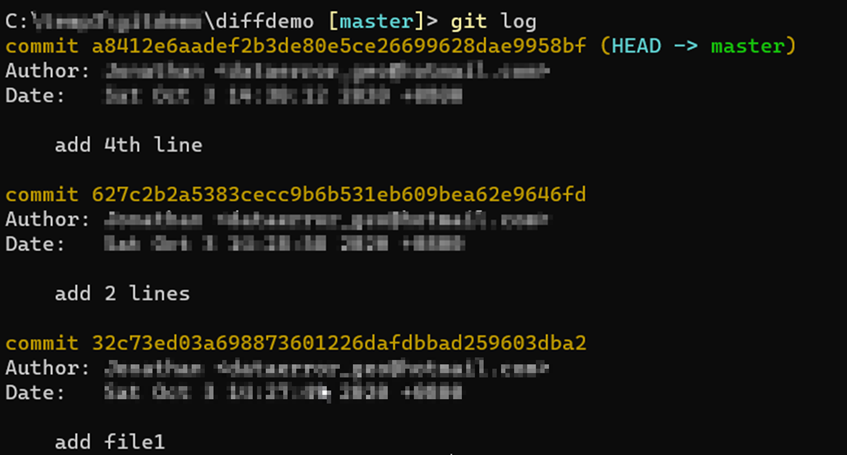

- [Overview](#overview)
- [Diff](#diff)
  - [Compare a file between two commits](#compare-a-file-between-two-commits)
  - [Compare a file in current working folder and HEAD](#compare-a-file-in-current-working-folder-and-head)
  - [Show files changed between two commits](#show-files-changed-between-two-commits)
  - [Showing the content difference between one commit and its parent](#showing-the-content-difference-between-one-commit-and-its-parent)
  - [show the file changes in staged area.](#show-the-file-changes-in-staged-area)
  - [Compare a file which has change name between two commits](#compare-a-file-which-has-change-name-between-two-commits)
  - [Using a custom diff tool](#using-a-custom-diff-tool)

# Overview
This demo show common command for doing differencing and comparison.

# Diff
## Compare a file between two commits
1. Initialize a new git repo.
2. Add a new file *file1.txt* and commit to *master* branch.
3. Add two lines of text to *file1.txt* and commit.
4. Add one more line of text to *file1.txt* and commit.
5. Run **git log** and your log should be something like this.
   
6. To compare changes of *file1.txt* between the last two commits, run **git diff \<hash for "add 2 lines"\> \<hash for "add 4th line"\> -- file1.txt**
   * The command of this is **git diff \<hash of baseline commit\> \<hash of new commit\> -- \<file to compare\>**
   * You can also show the changes between the first and last commit.
  
## Compare a file in current working folder and HEAD
We may want to compare the changes we make to a file before we commit. We can diff the file with the HEAD to see what changes we have made.
1. Initialize a new git repo.
2. Run following Powershell scripts to create a file and do a few commits.
```Powershell
Add-Content -Path .\file1.txt -Value 'line1'
git add file1.txt
git commit -m "add line 1"

Add-Content -Path .\file1.txt -Value 'line2'
git add file1.txt
git commit -m "add line 2"

Add-Content -Path .\file1.txt -Value 'line3'
git add file1.txt
git commit -m "add line 3"
```
3. We will now make another change.
```Powershell
Add-Content -Path .\file1.txt -Value 'line4'
Add-Content -Path .\file1.txt -Value 'line5'
```
4. We now would like to see what changes we have made. Run **git diff HEAD file1.txt**.
5. You should see that the changes is line4 and line5.
   
## Show files changed between two commits
1. Run **git init** to initialize a new repo
2. Run the following Powershell script. This will create 7 commits with one new file added in each commit.
   ```powershell
   Add-Content -Path .\file1.txt -Value 'file1'
   git add file1.txt
   git commit -m "add file 1"

   Add-Content -Path .\file2.txt -Value 'file2'
   git add file2.txt
   git commit -m "add file 2"

   Add-Content -Path .\file3.txt -Value 'file3'
   git add file3.txt
   git commit -m "add file 3"

   Add-Content -Path .\file4.txt -Value 'file4'
   git add file4.txt
   git commit -m "add file 4"

   Add-Content -Path .\file5.txt -Value 'file5'
   git add file5.txt
   git commit -m "add file 5"

   Add-Content -Path .\file6.txt -Value 'file6'
   git add file6.txt
   git commit -m "add file 6"

   Add-Content -Path .\file7.txt -Value 'file7'
   git add file7.txt
   git commit -m "add file 7"
   ```
3. Get the hash commit for 'add file 3' and 'add file 6'.
4. Run **git diff --name-only \<hash of add_file_3\>..\<hash of add_file_6\>**. You should see file4.txt, file5.txt and file6.txt.

## Showing the content difference between one commit and its parent
You can compare the difference between one specific commit and its parent.
1. Run the following powershell script to setup a demo repo.
   ```powershell
   git init

   Add-Content -Path .\file1.txt -Value 'line1'
   git add file1.txt
   git commit -m "add line1"


   Add-Content -Path .\file1.txt -Value 'line2'
   git add file1.txt
   git commit -m "add line2"

   Add-Content -Path .\file1.txt -Value 'line3'
   git add file1.txt
   git commit -m "add line2"


   Add-Content -Path .\file1.txt -Value 'line3a'
   Add-Content -Path .\file1.txt -Value 'line3b'
   Add-Content -Path .\file2.txt -Value 'line3b'
   git add file1.txt
   git add file2.txt
   git commit -m "add line3"

   Add-Content -Path .\file1.txt -Value 'line4'
   git add file1.txt
   git commit -m "add line4"  
   ```
2. Run ```git log``` to get the commit of "add line 3"
3. Run ```git show <commit id of 'add line 3'>```.
4. If you want to compare the commit at the HEAD to its parent, run ```git show```.
   
## show the file changes in staged area.
Before we commit our changes, we can view the compare the file changes in the staging area to the HEAD.   
1. Run the following Powershell script to initialize a repo and commit some changes.
   ```powershell
      git init

      Add-Content -Path .\file1.txt -Value 'file 1 line1'
      git add file1.txt
      git commit -m "add file1 line1"

      Add-Content -Path .\file2.txt -Value 'file 2 line1'
      git add file2.txt
      git commit -m "add file2 line1"

      Add-Content -Path .\file1.txt -Value 'file 1 line2'
      git add file1.txt
      git commit -m "add file1 line2"

      Add-Content -Path .\file1.txt -Value 'file 1 line3'
      git add file1.txt
      git commit -m "add file1 line3"   
   ```
2.  Run the following Powershell script to make some changes and add to staging area.
    ```powershell
      Add-Content -Path .\file1.txt -Value 'file 1 line4'
      git add file1.txt

      Add-Content -Path .\file3.txt -Value 'file 3 line1'
      git add file3.txt    
    ```  
3. Before we commit, we want to look at all the changes we made which are staged for commit. Run ```git diff --cached```. There are two files in the staging are. 
4. If we just want to look at the changes for **file1.txt**, run ```git diff --cached -- file1.txt```.
5. You can now run ```git commit -m "make some changes"``` to commit.
6. We will now delete **file2.txt**. Run ```git rm file2.txt```, and follow by ```git diff --cached```. Git will show that you deleted the file and all the contents are removed.
7.  Run the following Powershell script to make some changes and add to staging area.
    ```powershell
      Add-Content -Path .\file1.txt -Value 'file 1 line6'
      git add file1.txt

      Add-Content -Path .\file5.txt -Value 'file 5 line1'
      git add file5.txt    
    ```  
8. If we are not interested in the actual change, but just want to know what type of changes are in effect, run ```git diff --cached --name-status```. You should see following output.
      ```text
         M       file1.txt
         D       file2.txt
         A       file5.txt      
      ```
## Compare a file which has change name between two commits   
1. Run the following Powershell script to initialize a git repo and commit a file into repo.
   ```powershell
    git init

    Add-Content -Path .\file1.txt -Value 'This is file 1'
    git add file1.txt
    git commit -m "add file 1"

    Add-Content -Path .\file1.txt -Value 'add line A'
    git add file1.txt
    git commit -m "add line A"    
   ```
2. To rename the file, run the following git command
   ```powershell
   git mv file1.txt newname.txt
   ```    
3. The above command will rename the file and stage the file for commit (aka update index). Run ```git status``` to check the status of the index.
4. Run ```git commit -m "rename file1"``` to commit the change.  
5. Run the following Powershell script to add some changes to *newfile.txt*
   ```powershell
    Add-Content -Path .\newname.txt -Value 'Add line B'
    git add newname.txt
    git commit -m "Add line B"
   ```     
6. Run ```git log --oneline``` to get the commit history. Take note of the commit ID of "add file1" and "Add line B".
7. We will now compare the file difference between this two commits. *file1.txt* and *newname.txt* is actually same file but has been renamed. To get the difference of this file between two commits which has different name, run the following git command.
   ```powershell
   git diff <commit ID of add file1>:file1.txt <commit ID of Add line B>:newname.txt
   ```

## Using a custom diff tool
Git has a built-in diff tool to compare the difference between two files. We can set our own favorite diff tool to override the built-in tool.
1. Run the following Powershell script to initialize a repo and make a few commits.
   ```powershell
   git init

   Add-Content -Path .\file1.txt -Value 'line1'
   git add file1.txt
   git commit -m "add line 1"

   Add-Content -Path .\file1.txt -Value 'line2'
   git add file1.txt
   git commit -m "add line 2"

   Add-Content -Path .\file1.txt -Value 'line3'
   git add file1.txt
   git commit -m "add line 3"

   Add-Content -Path .\file1.txt -Value 'line4'
   git add file1.txt
   git commit -m "add line 4"
   ```
2. In this example, we will use a popular diff tool named WinMerge [Download WinMerge](https://winmerge.org/) 
3. I assume that you have installed or extract the WinMerge binaries to a folder.
4. Run the following script in a Powershell console to configure WinMerge as the diff tool, specifiy the path to the WinMerge executable and suppress the prompt when you run **git difftool**.
   ```powershell
   git config --local diff.tool winmerge
   git config --local difftool.winmerge.cmd 'C:\\path\\to\\winmerge\\WinMergeU.exe -e $LOCAL $REMOTE'
   git config --local difftool.prompt false
   ```
   ```text
   Note: Remember to use single quote because the dollar sign will be interpreted as variable in Powershell if you use double quote. Double slash is also necessary.
   ```
5. You can run ```git config --local --list``` to see the actual configuration. Or you can open .git/config in notepad.
6. To use WinMerge to compare the file between two commit, run ```git difftool <start commit>..<end commit>```. If you just want to compare a single file, run ```git difftool <start commit>..<end commit> --<file>```.