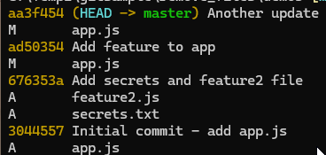
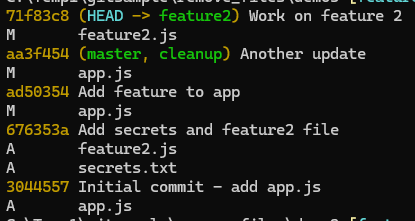
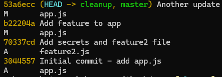
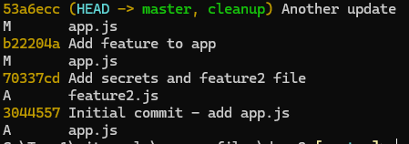
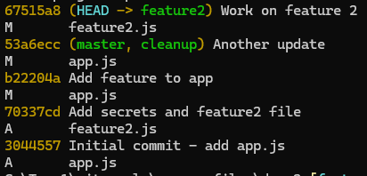

# Git Filter-Repo Demo Guide

## What is git-filter-repo?
git-filter-repo is a Git history-rewrite tool used to clean or transform repository history quickly and safely compared to older tools like filter-branch. It is commonly used to remove accidentally committed secrets, delete large files from all commits, rename paths across history, or rewrite author/metadata details.

It works by creating a rewritten commit graph where targeted content is removed or transformed, which means commit hashes change and the rewritten history must be coordinated with your team.

## What this script does (brief)
Scripts below creates a sample Git repository, intentionally commits a sensitive file (`secrets.txt`), makes additional commits/branches, then uses `git filter-repo` to rewrite history and remove that file from all commits.

It demonstrates **how to scrub a file from Git history**.

## Example use case
A developer accidentally committed credentials (API key/password) to the repo. You need to:
1. Remove that file from current and past commits.
2. Rewrite history so the file is no longer reachable in Git history.
3. Verify removal before pushing cleaned history.

## Demo steps
Run these in a terminal from a parent working folder.

1. Create and enter demo folder.
```powershell
mkdir demo
cd demo
```

2. Ensure `git-filter-repo` is installed. `git-filter-repo` is a Python tool, so you need Python and pip installed. Then run:
```powershell
pip install git-filter-repo
```

3. Initialize repository.
```powershell
git init
```

4. Add initial app file and commit.
```powershell
echo "console.log('App started');" > app.js
git add app.js
git commit -m "Initial commit - add app.js"
```

5. Add sensitive file and another feature file, then commit both.
```powershell
echo "API_KEY=super_secret_key_12345" > secrets.txt
echo "DATABASE_PASSWORD=hidden_password" >> secrets.txt
echo "console.log('feature 2 added');" > feature2.js
git add secrets.txt
git add feature2.js
git commit -m "Add secrets and feature2 file"
```

6. Add more commits after the sensitive commit.
```powershell
echo "console.log('Feature added');" >> app.js
git add app.js
git commit -m "Add feature to app"

echo "console.log('Another update');" >> app.js
git add app.js
git commit -m "Another update"
```

7. Inspect history (confirm `secrets.txt` appears).
```powershell
git log --oneline --name-status
git log --all -- secrets.txt
```




8. Create a safety branch before rewrite.
```powershell
git checkout -b cleanup
```

9. Create a side branch (`feature2`) with additional changes.
```powershell
git checkout master
git checkout -b feature2
echo "console.log('Feature 2 work');" >> feature2.js
git add feature2.js
git commit -m "Work on feature 2"
git log --oneline --name-status
```




10. Return to cleanup branch and rewrite history to remove `secrets.txt`.
```powershell
git checkout cleanup
git filter-repo --path secrets.txt --invert-paths --force
```

11. Verify removal from history and working tree.
```powershell
git log --oneline --name-status
git log --all -- secrets.txt
ls secrets.txt
```
  

You should see no commits referencing `secrets.txt` and the file should not exist in the working directory.
The commit hashes have changed due to the rewrite.

12. Switch back to *master* and review history.
```powershell
git checkout master
git log --oneline --name-status
```

  

The commit history on *master* should also reflect the removal of `secrets.txt` and the file should no longer be present in any commit. The hashes will differ from the original history.

13. Switch to *feature2* and review history.
```powershell
git checkout feature2
git log --oneline --name-status
```


14. Clean local references to old objects.
```powershell
git reflog expire --expire=now --all
git gc --aggressive --prune=now
```

## Caveats of this script and approach
1. **History rewrite changes commit SHAs**: existing PR links and commit references may break.
2. **Force push is required** after rewrite.
3. **Team resync is mandatory**: teammates should usually reclone or hard-reset.
4. **Backups are critical** before rewriting.
5. **Sensitive data may linger locally** until reflog/GC cleanup is done.
6. **Secrets are still compromised**: rotate keys/passwords immediately.
7. **All refs must be considered**: tags, non-default branches, hidden refs, forks.
8. **Large repos may take time** and heavy disk I/O for rewrite.
9. **LFS objects need separate handling** if the sensitive file was in Git LFS.

[More details about caveats](git-filter-repo-caveats.md)


## Simple force-push script (after verification)
Run this only after you confirm the sensitive file is removed and teammates are informed.

```powershell
# Push all rewritten branches and clean deleted remote refs
git push origin --force --all
git push origin --force --tags
git push origin --prune
```

## Recommended Safe Sequence
1. Announce freeze window to team.
2. Take backup/snapshot.
3. Rewrite with `git filter-repo`.
4. Verify file/object removal locally.
5. Expire reflog and run garbage collection.
6. Force push rewritten history to origin.
7. Re-verify from a fresh clone.
8. Instruct team to reclone or hard reset.
9. Rotate any exposed secrets.


History rewrite reduces exposure in Git history, but credential rotation addresses the security risk itself.
